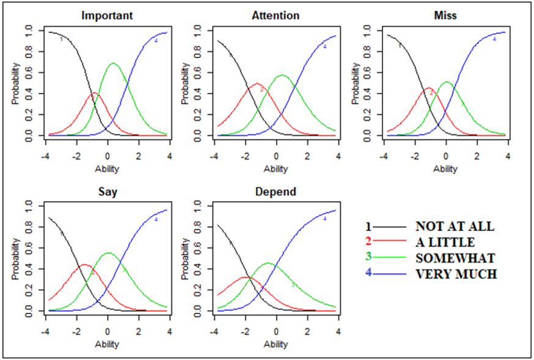
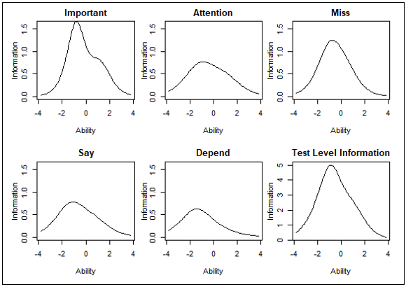

```{r setup, include=F}
library(kableExtra, quietly = T)
library(dplyr, quietly = T)
options(knitr.table.format = "latex")
options(kableExtra.latex.load_packages = T)
knitr::opts_chunk$set(echo = FALSE)
```

# Background

## Introduction

How one analyzes and makes inferences about test items plays a vital role in measurement. 

This study showed how inferences and interpretations made from the items intended to measure students’ feelings about mattering would differ across different measurement theories. 

## Introduction

Classical test theory (CTT) or "true score theory"

  \begin{equation}
  X_{observed} = X_{true} + error
  \end{equation}

Item response theory (IRT) or "modern test theory"^[Specifically for this study the Generalized Partial Credit Model]

  \begin{equation}
  P\left(Y_{zi}=x\right)=\frac{\exp{\Sigma_{h=0}^x\left(\alpha_i\left(\theta_z-\delta_{ih}\right)\right)}}{1+\Sigma_{j=1}^{M_i}\exp{\Sigma_{h=1}^j\left(\alpha_i\left(\theta_z-\delta_{ih}\right)\right)}}
  \end{equation}

## Mattering: Am I Significant?

  - Rosenberg and McCullough (1981) stated three elements of mattering: attention, importance, and dependence. This has continued to constitute the theoretical base of measurements and explain external validation of a person by others. 
  - This external validation comes true at the interpersonal and societal levels
    - The interpersonal dimension indicates individuals’ level of mattering to people in their lives. 
    - The societal dimension includes individuals’ perception of mattering toward outer world, such as, schools, governmental institutions, religious institutions.

# Data

## Participants and Measure

\begin{columns}[t]
  \column{.35\textwidth}
  \begin{itemize}
  \item Volunteer students attending university in Turkey
    \begin{itemize}
    \item $n = 1623$
    \item 5 different universities
    \item 59.5% female
    \item Ages: 17 to 39, $\bar x=21.4$
    \end{itemize}
  \end{itemize}
  
  \column{.65\textwidth}
   \begin{itemize}
   \item General Mattering Scale - Turkish (GMS-TS; Haktanir et al., 2016)
    \begin{itemize}
    \item GMS (original; Marcus, 1991) developed to assess the degree individuals believe how they are important to others
    \item 5-point Likert
    \item 4 items
    \item Previous studies: $\alpha=.76$
    \end{itemize}
  \end{itemize}
\end{columns}

# Analysis

## CTT vs IRT
  
\begin{columns}[t]
  \column{.5\textwidth}
  \begin{itemize}
    \item CTT Calculations
    \begin{itemize}
      \item SPSS v22.0 (IBM, 2013)
      \item Mean of response categories
      \item Observed Score distribution
      \item Item mean
      \item Item discrimination 
      \item Reliability (Cronbach's $\alpha$)
    \end{itemize}
  \end{itemize}
  
  \column{.5\textwidth}
  \begin{itemize}
  \item IRT Calculations
    \begin{itemize}
      \item R package `ltm` (R Core Team, 2016; Rizopoulos, 2017)
      \item Item parameters (step difficulty, discrimination)
      \item Item information
      \item Test information
    \end{itemize}
  \end{itemize}
\end{columns}  

# Results

## CTT Findings - Item Descriptives

```{r CTT findings item descriptives}
cttDesc <- matrix(data = c(
  14.6,21.4,46.8,17.2,
  8.7,27.0,44.0,20.3,
  10.3,22.1,36.7,30.9,
  7.5,21.2,43.9,27.4,
  6.3,12.8,36.8,44.1), 
  ncol = 4, 
  byrow = T
  )# %>% apply(2, sprintf, fmt = "%.2f")
  
colnames(cttDesc) = c("Not At All", "A Little", "Somewhat", "Very Much")
rownames(cttDesc) = c("Important", "Attention", "Miss", "Say", "Depend")

cttDesc %>%
  kable(booktabs = T) %>%
  column_spec(column = 1:4, width = ".75in") %>%
  kable_styling(latex_options = "scale_down") %>%
  add_header_above(header = c("Item" = 1, "Response Options" = 4),
                   line = T)
```

\small
Note: Values are percentages

## CTT Findings - Item Statistics

```{r CTT findings item statistics}
cttStats <- matrix(data = c(
  2.66,	0.92,	0.59,	0.70,
  2.75,	0.87,	0.52,	0.72,
  2.88,	0.96,	0.57,	0.71,
  2.91,	0.87,	0.53,	0.72,
  3.18,	0.87,	0.45,	0.75),
  ncol = 4,
  byrow = T
) %>% apply(2, sprintf, fmt = "%.2f")
cttItemLevel <- c("Important", "Attention", "Miss", "Say", "Depend")

colnames(cttStats) = c("Mean", "Standard Deviation", 
                       "Item-Total Correlation", "Alpha if deleted")
rownames(cttStats) = cttItemLevel

cttStats %>%
  kable(booktabs = T) %>%
  column_spec(column = 1:4, width = ".75in") %>%
  kable_styling(latex_options = "scale_down")
```

## CTT Findings - Scale Statistics

```{r CTT findings by scale}
cttScaleStats = matrix(c(2.88, 0.64, 0.41, .76), nrow = 1, byrow = T)
colnames(cttScaleStats) = c("Mean", "Standard Deviation", "Variance", "Alpha")
rownames(cttScaleStats) = "Scale Level"

cttScaleStats %>%
  kable(booktabs = T) %>%
  column_spec(column = 1:4, width = ".75in") %>%
  kable_styling(latex_options = "scale_down")
```

## IRT Findings - Item Parameters

```{r IRT item parameters}
irtParam = matrix(c(
  -1.06,-0.64,1.24,1.64,
  -1.81,-0.60,1.17,1.16,
  -1.46,-0.65,0.53,1.37,
  -1.86,-0.94,0.81,1.10,
  -1.79,-1.66,-0.05,0.83),
  ncol = 4,
  byrow = T)

colnames(irtParam) = c("b1", "b2", "b3", "a")
rownames(irtParam) = c("Important", "Attention", "Miss", "Say", "Depend")

irtParam %>%
  kable(booktabs = T) %>%
  column_spec(column = 1:4, width = ".85in") %>%
  kable_styling(latex_options = "scale_down") %>%
  add_header_above(header = c("Item" = 1, "Step Parameters" = 3, "Discrimination"),
                   line = T)
```

## IRT Findings - Item Characteristic Curves

{height=250px}

## IRT Findings - Information Curves

{height=250px}

# Discussion

## CTT Findings

- Students generally selected the third response option ("somewhat") the most
- Students generally selected the first response option ("Not At All") the least
- The "Depend" item had the lowest item discrimination
  - Perhaps due to distribution of response options
  - Probably least effective item
  
## IRT Findings

- The "Depend" item had the lowest item discrimination
  - Little information
  - Easiest item
- Greatest information found just below ability mean
  - All items peaked below $\theta=0$
- The "Important" item was most informative
  - Highest discrimination
  - Highest information peak
  - Second peak higher than other items' peak!
  
## Corresponding Author

\center{\huge{anthony.w.raborn@gmail.com}}

# References

## References

\small

Haktanir, A., Lenz, A. S., Can, N., & Watson, J. C. (2016). Development and evaluation of Turkish language versions of three positive psychology assessments. *International Journal for the Advancement of Counselling, 38*, 286-297. doi:10.1007/s10447-016-9272-9 

IBM Corp. (2013). *IBM SPSS Statistics for Windows, Version 22.0*. Armonk, NY: IBM Corp. 

Marcus, F. M. (1991). *Mattering: Its measurement and theoretical significance for social psychology*. Paper presented at the annual meeting of the Eastern Sociological Association, Cincinnati.  

R Core Team (2016). R: A language and environment for statistical computing [computer software manual]. Vienna, Austria. Retrieved from http://www.R-project.org/ 

Rizopoulos, D. (2017). Package “ltm”, Latent Trait Models under IRT. Retrieved from https://cran.r-project.org/web/packages/ltm/ltm.pdf 
