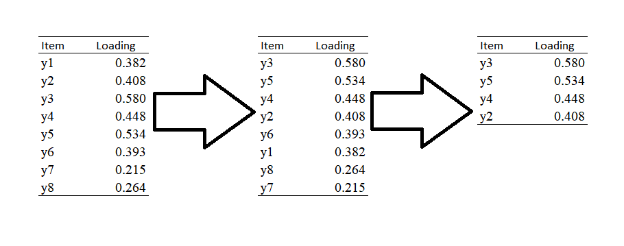

---
title:
  - "Comparison of Automated Short Form Selection Strategies"
author: 
  - "Anthony Raborn$^1$"
  - "Walter Leite"
  - "Katerina Marcoulides"
institute: 
  - "Research and Evaluation Methodology Department"
  - "University of Florida"
  - "1: anthony.w.raborn@gmail.com"
date: 
  - "November 14, 2018"
output: 
  beamer_presentation:
    template: 'no-section-heading.tex'
    theme: "PaloAlto"
    colortheme: "orchid"
    # citation_package: biblatex
    keep_tex: true
bibliography: fera2018.bib
csl: apa.csl
editor_options: 
  chunk_output_type: console
header-includes:
- \usepackage{booktabs}
- \usepackage{longtable}
- \usepackage{array}
- \usepackage{multirow}
- \usepackage{wrapfig}
- \usepackage{float}
- \usepackage{colortbl}
- \usepackage{pdflscape}
- \usepackage{tabu}
- \usepackage{threeparttable}
- \usepackage{threeparttablex}
- \usepackage[normalem]{ulem}
- \usepackage{makecell}
- \usepackage{caption}
---

```{r setup, include=FALSE}
knitr::opts_chunk$set(echo = FALSE)
library(kableExtra)
library(dplyr)
options(digits = 3)
```

# Introduction

## Applications of Psychometric Scales

Applied researchers are often faced with a dilemma, both with drawbacks:

\begin{enumerate}[A]
  \item Use a well-established but lengthy scale \\
    -- Potentially longer administration time for less information
  \item Use a few items from a scale \\
    -- Potentially greater information but weaker validity evidence
\end{enumerate}

In the literature, researchers attempt to use Option B with some effort spent on collecting validity evidence

## Examples of Item Selection Methods for Short Forms

1. Hand-Selecting Items
  - Using theoretical or practical justifications per item [e.g., @noble2013short]
  - Retaining one of many (qualitatively) redundant items [e.g., @dennis2003breastfeeding]
2. Statistical Criteria
  - Retaining items with high factor loadings or item correlations [e.g., @byrne2011development;@wester2012development]
  - Selecting items that improve measures of reliability and/or dimensionality [e.g., @lim2013development; @veale2014edinburgh]
  
<!-- Overall, the focus of the above examples are on the internal structure of the scales. This is in spite of researchers wanting to use the short form for predictive/correlational purposes. -->    

## Problem

Creating short forms with (1) good internal structure and (2) good predictive, convergent, and/or divergent validity is difficult by hand using *any* criteria.

One potential solution would be to use metaheuristic optimization algorithms [@dreo2006metaheuristics]. <!-- which can *simultaneously optimize* multiple criteria, particularly the internal structure and external relationships of a scale. -->

## Goals of this Study

- Compare different automatic scale reduction strategies
  1. Model fit of final scales (better fit is better)
  2. Removal of specific problematic items (fewer problematic items is better)
  3. Reliability of final scales (higher reliability is better)
  4. Time to converge (faster is better)
- Determine which factors affect these comparisons
  1. Population model type (one factor, three factor)
  2. Severity of problematic items (none, minor, major)
  3. Strength of relationship to external criterion (none, moderate)

# Theoretical Framework

## Previous Attempts

Some "common" algorithms in the literature:

1. "Maximize Main Loadings" (not investigated)
2. Ant Colony Optimization (ACO)
3. Tabu Search (TS)
4. Genetic Algorithm (GA)

An additional method investigated in this study:

5. Simulated Annealing (SA)

<!--
## Maximize Main Loadings

{width=400px}

## Trial

\begin{columns}[t]
\column{.5\textwidth}
\centering
\includegraphics[width=5cm,height=3.5cm]{Methods Diagrams/aco.jpg}\\
\includegraphics[width=5cm,height=3.5cm]{Methods Diagrams/ts.png}
\column{.5\textwidth}
\centering
\includegraphics[width=5cm,height=3.5cm]{Methods Diagrams/ga.png}\\
\includegraphics[width=5cm,height=3.5cm]{Methods Diagrams/sa.jpg}
\end{columns}

## Ant Colony Optimization Algorithm

![Ant Colony Optimization [@toksari2016hybrid]](Methods Diagrams/aco.jpg){width=300px}

## Tabu Search

![Tabu Search [@ali2016concentric]](Methods Diagrams/ts.png){height=250px}

## Genetic Algorithm

$$-Fitness=(Number\ of\ Items)*(Item\ cost)+\Sigma^s_{i=1}(1-R^2_i)$$

![Genetic Algorithm [@liao2001educational]](Methods Diagrams/ga.png){width=175px}

## Simulated Annealing

$$P(model_2|fit_1,fit_2,currentTemp) = \begin{cases} exp{\frac{-(fit_2-fit_1)}{currentTemp}}, & fit_1>fit_2 \\ 1, & fit_1 \leq fit2 \end{cases}$$

![Simulated Annealing [@wang2013d3]](Methods Diagrams/sa.jpg){height=150px}

# Research Questions

## Research Questions

1. How do the algorithms differ in terms of the time it takes for each to converge on a short form?
2. How do model misspecifications in the full form affect the fit and reliability of the short forms created by the algorithms?
3. Does the inclusion of a covariate affect the model fit and reliability of the short forms and the exclusion of problematic items?
4. Do the algorithms differ in their ability to exclude problematic items from the short forms?
5. Do any of the above differ by full form dimensionality?
-->

# Method

## Factors Manipulated

1. The dimensionality of the full form
  - One Factor
  - Three Factor
2. Full-scale model misspecification
  - No misspecification
  - Minor misspecification (six items loading on a nuisance parameter with $\lambda=.3$)
  - Major misspecification (six items loading on a nuisance parameter with $\lambda=.6$)
3. Relationship to External Criterion Variable
  - No relationship
  - Moderate relationship ($\gamma = .6$)

<!--Note: The factors are not fully crossed: in the Moderate Relationship conditions, we did not investigate the Minor Misspecification condition. -->
<!--
## Models

\begin{columns}[t]
\column{.5\textwidth}
\centering
\includegraphics[width=\columnwidth]{"Factor Diagrams/One Factor Diagram".png}
\captionof{figure}{The 20-Item Self-Deceptive Enhancement Scale}
\column{.5\textwidth}
\centering
\includegraphics[width=\columnwidth]{"Factor Diagrams/Three Factor Diagram".png}
\captionof{figure}{The 24-Item Teacher Efficacy Scale}
\end{columns}

\tiny
@leite2005validation \hfill @tschannen2001teacher

-->
## One Factor Model

![20-item Self-Deceptive Enhancement Scale [@leite2005validation]](Factor Diagrams/One Factor Diagram.png){width=275px}

## Three Factor Model

![24-item Teacher Efficacy Scale [@tschannen2001teacher]](Factor Diagrams/Three Factor Diagram.png){width=370px}

## Simulation

Program: R [@RCT2018]

Packages: 

1. `MASS` [@Venables2002] (data simulation)
2. `ShortForm` [@Raborn2018] (ACO, SA, TS)
3. `GAabbreviate` [@Sahdra2016] (GA; modified)

Sample Size: $n = 500$

Iterations: 100

## Analysis of Results

1. CFI, TLI, RMSEA
2. Proportion of iterations including each problematic item (excluding no error condition)
3. Composite reliability of each factor: 
$$CR_{factor} = \frac{(\Sigma^I_{i=1}Loading_i)^2}{(\Sigma^I_{i=1}Loading_i)^2 + \Sigma^I_{i=1}(Residual^2_i)} $$
4. Run time of algorithms 

# Results

## One Factor Model Fit: No External Variable

```{r one factor no external results}
oneFactorNoEx <- read.csv("Results/one factor no external model fit.csv")[,-1]
colnames(oneFactorNoEx) = c("Error Condition", "Method", "Min. to Complete", "CFI", "TLI", "RMSEA", "Composite Reliability")
oneFactorNoEx %>%
  select("Error Condition", "Method", "CFI", "TLI", "RMSEA") %>%
  mutate(CFI = sprintf(fmt = "%.3f", CFI), TLI = sprintf(fmt = "%.3f", TLI), RMSEA = sprintf(fmt = "%.3f", RMSEA)) %>%
  mutate(CFI = cell_spec(CFI, "latex", bold = ifelse(as.numeric(CFI) >= .95, TRUE, FALSE)),
         TLI = cell_spec(TLI, "latex", bold = ifelse(as.numeric(TLI) >= .95, TRUE, FALSE)),
         RMSEA = cell_spec(RMSEA, "latex", bold = ifelse(as.numeric(RMSEA) <= .05, TRUE, FALSE))) %>% 
  kable('latex', escape = F, booktabs = T) %>%
  column_spec(column = 1:7, width = "0.7in") %>%
  collapse_rows(columns = 1, valign = "middle", latex_hline = "major") %>%
  kable_styling(latex_options = "scale_down") 
#  footnote(general = c("Larger error reduces model fit in general, but does not have much effect on reliability."))
```


## One Factor Model Fit: External Variable
\small
```{r one factor moderate external results}
oneFactorMajorEx <- read.csv("Results/one factor major external model fit.csv")[,-1]
colnames(oneFactorMajorEx) = c("Error Condition", "External Relationship", "Method", "Min. to Complete", "CFI", "TLI", "RMSEA", "Reliability")
oneFactorMajorEx$`Error Condition` = ""
oneFactorMajorEx %>%
  select("Error Condition",  "External Relationship", "Method", "CFI", "TLI", "RMSEA") %>%
  mutate(CFI = sprintf(fmt = "%.3f", CFI), TLI = sprintf(fmt = "%.3f", TLI), RMSEA = sprintf(fmt = "%.3f", RMSEA)) %>%
  mutate(CFI = cell_spec(CFI, "latex", bold = ifelse(as.numeric(CFI) >= .95, TRUE, FALSE)),
         TLI = cell_spec(TLI, "latex", bold = ifelse(as.numeric(TLI) >= .95, TRUE, FALSE)),
         RMSEA = cell_spec(RMSEA, "latex", bold = ifelse(as.numeric(RMSEA) <= .05, TRUE, FALSE))) %>% 
  kable('latex', escape = F, booktabs = T) %>%
  column_spec(column = 1:5, width = "1in") %>%
  group_rows(group_label = "None", start_row = 1, end_row = 8) %>%
  group_rows(group_label = "Major", start_row = 9, end_row = 16) %>%
    collapse_rows(columns = 2, valign = "middle", latex_hline = "major") %>%
  kable_styling(latex_options = "scale_down") 
#  footnote(general = c("Larger error reduces model fit in general.", "A moderately related external variable does not improve model fit."))
```

## One Factor Item Selection Proportions: No External Variable

```{r one factor item selection no external}
oneFactorBadItems <- read.csv("Results/one factor no external bad items.csv", stringsAsFactors = T)
colnames(oneFactorBadItems) = c("Error Condition", "Item", "Factor Loading", "ACO", "SA", "TS", "GA")
oneFactorBadItems$`Factor Loading` = sprintf("%.3f", oneFactorBadItems$`Factor Loading`)
averagePropSelectedOne = as.data.frame(rbind(colMeans(oneFactorBadItems[1:6,4:7]), colMeans(oneFactorBadItems[7:12,4:7])))
oneFactorBadItems[,4:7] = round(oneFactorBadItems[,4:7]/100, 2)
oneFactorBadItems[,4:7] = apply(oneFactorBadItems[,4:7], 2, sprintf, fmt = "%.2f")

averagePropSelectedOne$Item = averagePropSelectedOne$`Factor Loading` = ""
averagePropSelectedOne$`Error Condition` = c("Minor Error Average Proportion:", "Major Error Average Proportion:")
averagePropSelectedOne[,1:4] = round(averagePropSelectedOne[,1:4]/100, 3)
averagePropSelectedOne[,1:4] = apply(averagePropSelectedOne[,1:4], 2, sprintf, fmt = "%.3f")

oneFactorBadItems = rbind(oneFactorBadItems, averagePropSelectedOne)

oneFactorBadItems %>% 
  kable('latex', booktabs = T) %>%
  # column_spec(column = 1:7, width = "0.7in") %>%
  collapse_rows(columns = 1, valign = "middle", latex_hline = "major") %>%
  row_spec(row = 13:14, bold = T) %>%
  kable_styling(latex_options = "scale_down")
#  footnote(general = c("Larger error reduces problematic item selection only for ACO and SA."))
```

## One Factor Item Selection Proportions: External Variable

```{r one factor item selection external}
oneFactorBadItems <- read.csv("Results/one factor external bad items.csv", stringsAsFactors = T)
colnames(oneFactorBadItems) = c("Error Condition", "External Condition", "Item", "Factor Loading", "ACO", "SA", "TS", "GA")
oneFactorBadItems$`Factor Loading` = sprintf("%.3f", oneFactorBadItems$`Factor Loading`)
averagePropSelectedone = as.data.frame(rbind(colMeans(oneFactorBadItems[1:6,5:8]), colMeans(oneFactorBadItems[7:12,5:8])))
oneFactorBadItems[,5:8] = round(oneFactorBadItems[,5:8]/100, 2)
oneFactorBadItems[,5:8] = apply(oneFactorBadItems[,5:8], 2, sprintf, fmt = "%.2f")

averagePropSelectedone$Item = averagePropSelectedone$`Factor Loading` = averagePropSelectedone$`Error Condition` = ""
averagePropSelectedone$`External Condition` = c("No External Average Proportion:", "Moderate External Average Proportion:")
averagePropSelectedone[,1:4] = round(averagePropSelectedone[,1:4]/100, 3)
averagePropSelectedone[,1:4] = apply(averagePropSelectedone[,1:4], 2, sprintf, fmt = "%.3f")

oneFactorBadItems = rbind(oneFactorBadItems, averagePropSelectedone)

oneFactorBadItems %>% 
  kable('latex', booktabs = T) %>%
  # column_spec(column = 1:7, width = "0.7in") %>%
  collapse_rows(columns = 2, valign = "middle", latex_hline = "major") %>%
  row_spec(row = 13:14, bold = T) %>%
  kable_styling(latex_options = "scale_down")
#  footnote(general = "The addition of a moderately related external variable drastically reduces problematic item selection overall.")

```

## Three Factor Model Fit: No External Variable

```{r three factor no external results}
threeFactorNoEx <- read.csv("Results/three factor no external model fit.csv")[,-1]
colnames(threeFactorNoEx) = c("Error Condition", "Method", "Min. to Complete", "CFI", "TLI", "RMSEA", "Reliability: Engage", "Reliability: Instruct", "Reliability: Manage")
threeFactorNoEx %>%
  select("Error Condition", "Method", "CFI", "TLI", "RMSEA") %>%
  mutate(CFI = sprintf(fmt = "%.3f", CFI), TLI = sprintf(fmt = "%.3f", TLI), RMSEA = sprintf(fmt = "%.3f", RMSEA)) %>%
  mutate(CFI = cell_spec(CFI, "latex", bold = ifelse(as.numeric(CFI) >= .95, TRUE, FALSE)),
         TLI = cell_spec(TLI, "latex", bold = ifelse(as.numeric(TLI) >= .95, TRUE, FALSE)),
         RMSEA = cell_spec(RMSEA, "latex", bold = ifelse(as.numeric(RMSEA) <= .05, TRUE, FALSE))) %>% 
  kable('latex', escape = F, booktabs = T) %>%
  column_spec(column = 1:5, width = "0.7in") %>%
  collapse_rows(columns = 1, valign = "middle", latex_hline = "major") %>%
  kable_styling(latex_options = "scale_down")
#  footnote(general = c("Larger error generally results in worse model fit.", "Reliability remains about the same in all conditions."))
```


## Three Factor Model Fit: External Variable

```{r three factor moderate external results, results='asis'}
threeFactorMajorEx <- read.csv("Results/three factor major external model fit.csv")[,-1]
colnames(threeFactorMajorEx) = c("Error Condition", "External Relationship", "Method", "Min. to Complete", "CFI", "TLI", "RMSEA", "Reliability: Engage", "Reliability: Instruct", "Reliability: Manage")
threeFactorMajorEx$`Error Condition` = ""
threeFactorMajorEx %>%
  select("Error Condition", "External Relationship", "Method", "CFI", "TLI", "RMSEA") %>%
  mutate(CFI = sprintf(fmt = "%.3f", CFI), TLI = sprintf(fmt = "%.3f", TLI), RMSEA = sprintf(fmt = "%.3f", RMSEA)) %>%
  mutate(CFI = cell_spec(CFI, "latex", bold = ifelse(as.numeric(CFI) >= .95, TRUE, FALSE)),
         TLI = cell_spec(TLI, "latex", bold = ifelse(as.numeric(TLI) >= .95, TRUE, FALSE)),
         RMSEA = cell_spec(RMSEA, "latex", bold = ifelse(as.numeric(RMSEA) <= .05, TRUE, FALSE))) %>% 
  kable('latex', escape = F, booktabs = T) %>%
  column_spec(column = 1:5, width = "1in") %>%
  group_rows(group_label = "None", start_row = 1, end_row = 8) %>%
  group_rows(group_label = "Major", start_row = 9, end_row = 16) %>%
    collapse_rows(columns = 2, valign = "middle", latex_hline = "major") %>%
  kable_styling(latex_options = "scale_down")
#  footnote(general = c("Larger error generally results in worse model fit, even with a moderately related external variable.","Reliability remains about the same in all conditions."))
```

## Three Factor Item Selection Proportions: No External Variable

```{r three factor item selection no external}
threeFactorBadItems <- read.csv("Results/three factor no external bad items.csv", stringsAsFactors = T)
colnames(threeFactorBadItems) = c("Error Condition", "Item", "Factor Loading", "ACO", "SA", "TS", "GA")
averagePropSelectedthree = as.data.frame(rbind(colMeans(threeFactorBadItems[1:6,4:7]), colMeans(threeFactorBadItems[7:12,4:7])))
threeFactorBadItems[,4:7] = round(threeFactorBadItems[,4:7]/100, 2)
threeFactorBadItems[,4:7] = apply(threeFactorBadItems[,4:7], 2, sprintf, fmt = "%.2f")

averagePropSelectedthree$Item = averagePropSelectedthree$`Factor Loading` = ""
averagePropSelectedthree$`Error Condition` = c("Minor Error Average Proportion:", "Major Error Average Proportion:")
averagePropSelectedthree[,1:4] = round(averagePropSelectedthree[,1:4]/100, 3)
averagePropSelectedthree[,1:4] = apply(averagePropSelectedthree[,1:4], 2, sprintf, fmt = "%.3f")

threeFactorBadItems = rbind(threeFactorBadItems, averagePropSelectedthree)

threeFactorBadItems %>% 
  kable('latex', booktabs = T) %>%
  # column_spec(column = 1:7, width = "0.7in") %>%
  collapse_rows(columns = 1, valign = "middle", latex_hline = "major") %>%
  row_spec(row = 13:14, bold = T) %>%
  kable_styling(latex_options = "scale_down")
#  footnote(general = "Larger error generally results in fewer problematic items selected.")
```

## Three Factor Item Selection Proportions: External Variable

```{r three factor item selection external}
threeFactorBadItems <- read.csv("Results/three factor external bad items.csv", stringsAsFactors = T)
colnames(threeFactorBadItems) = c("Error Condition", "External Condition", "Item", "Factor Loading", "ACO", "SA", "TS", "GA")
averagePropSelectedthree = as.data.frame(rbind(colMeans(threeFactorBadItems[1:6,5:8]), colMeans(threeFactorBadItems[7:12,5:8])))
threeFactorBadItems[,5:8] = round(threeFactorBadItems[,5:8]/100, 2)
threeFactorBadItems[,5:8] = apply(threeFactorBadItems[,5:8], 2, sprintf, fmt = "%.2f")

averagePropSelectedthree$Item = averagePropSelectedthree$`Factor Loading` = averagePropSelectedthree$`Error Condition` = ""
averagePropSelectedthree$`External Condition` = c("No External Average Proportion:", "Moderate External Average Proportion:")
averagePropSelectedthree[,1:4] = round(averagePropSelectedthree[,1:4]/100, 3)
averagePropSelectedthree[,1:4] = apply(averagePropSelectedthree[,1:4], 2, sprintf, fmt = "%.3f")

threeFactorBadItems = rbind(threeFactorBadItems, averagePropSelectedthree)

threeFactorBadItems %>% 
  kable('latex', booktabs = T) %>%
  # column_spec(column = 1:7, width = "0.7in") %>%
  collapse_rows(columns = 2, valign = "middle", latex_hline = "major") %>%
  row_spec(row = 13:14, bold = T) %>%
  kable_styling(latex_options = "scale_down")
#  footnote(general = "No noticeable effect of External Condition on problematic item selection.")
```

# Discussion

## Best Performing Methods

  1. Removal of specific problematic items: **SA**
  2. Model fit of final scales: **SA**
  3. Reliability of final scales: About equivalent (*ACO* somewhat higher) 
  4. Time to converge: About equivalent (*TS* one factor longer) 

Overall: SA consistently had good^[CFI > .95, TLI > .95, RMSEA < .05] fit; ACO & TS consistently had at least adequate^[CFI > .90, TLI > .90, RMSEA < .08] fit; GA produced poor fit in the presence of major error

## Factors Affecting Comparisons
\small
\begin{enumerate}
   \item Population model type\\
      -- model fit: one factor < three factor\\
      -- Minimal effect on time to converge
  \item Severity of problematic items\\
      -- Decreased model fit, \textbf{SA} excluded
  \item  Strength of relationship to external criterion\\
      -- Somewhat attenuates effect of error only for \textbf{ACO}
\end{enumerate}

<!--
## Overall Conclusions

\begin{enumerate}
   \item Simulated annealing performs best\\
    -- Overall best fit in all conditions
   \item Genetic algorithms are best suited for well-defined scales that adhere to the theorized structure\\
    -- Misspecifications in the model $\rightarrow$ Worse short form\\
    -- External Criterion Variable $\rightarrow$ not much affect\\
   \item Overall, ant colony optimization, Tabu search, and simulated annealing produce adequate* forms in all conditions
\end{enumerate}

\*CFI > .90, TLI > .90, RMSEA < .08
-->

## For the Future

### Suggestions for Applied Researchers

\begin{enumerate}[A]
  \item Apply each algorithm to your sample--grab some coffee or tea while they each run!
  \item Compare the resulting short forms against one another ("face validity" comparisons).
  \item When possible, test against a second sample (cross-validation).
\end{enumerate}

### Future Research Questions

1. How well do the short forms created by each algorithm generalize to new samples?
2. How do additional manipulations (e.g., population models, types of errors) affect the algorithms?

## Corresponding Author

\center{\huge{anthony.w.raborn@gmail.com}}

<!--
## Take Home Messages

- With one and three factor scales, automatic scale reduction strategies are *quick* (typically < 3 minutes) and *robust* (good model fit, good reliability, fewer problematic items)
- Simulated Annealing consistently has best fit and fewest problematic items
- Ant Colony Optimization has somewhat better levels of reliability
- Including an external (criterion) variable while reducing the scale can help fit and reliability
- More error in full scale model can reduce short form fit
-->
# References

## References {.allowframebreaks}


\tiny