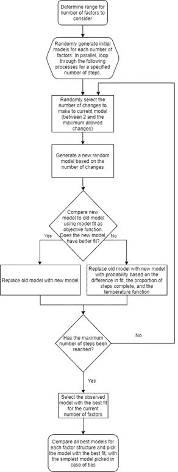

```{r setup, echo = F}
suppressMessages(
  library(tidyverse, quietly = T)
  )
suppressMessages(
  library(kableExtra, quietly = T)
  )
knitr::opts_chunk$set(echo=F)
options(dplyr.summarise.inform = F)
suppressMessages(
  library(lavaan, quietly = T)
)
```

# Background

How can we tell the number of latent factors that explain a set of items while
developing a scale?

. . .

In applied settings, the general framework is to use an Exploratory Factor Analysis 
(EFA) with part (e.g., half) of a data set of responses to items in order to generate
hypothesis about the factor structure, then apply a Confirmatory Factor Analysis 
(CFA) to test these hypothesis.

. . .

This can sometimes fail as standard EFA methods do not test for _simple structures_,
where each item is related to one and only one latent factor, leading to the CFA 
rejecting the hypothesis created based on the EFA.

# Example EFA Output

```{r example-efa, echo = F}
exampleData <-
  readRDS("data/Factors = 2, Median Loadings = 0,8, # Items Per Factor = 5, Total Items = 10, Factor Correlation = 0,3, Obs Per Item = 80.RDS")[[1]]

set.seed(20211118)
splitIndex <-
  sample.int(n = nrow(exampleData),
             size = nrow(exampleData)/2)
trainData <-
  exampleData[splitIndex,]
testData <-
  exampleData[-splitIndex,]

print(
  factanal(trainData, factors = 2)$loadings,
  cutoff = 0.0
)

```
# Example CFA Output

```{r example-cfa, echo=F}
model <-
  'F1 =~ Item1 + Item2 + Item3 + Item4 + Item5
   F2 =~ Item6 + Item7 + Item8 + Item9 + Item10
   
   F1 ~~ F2
   '

fitModel <-
  cfa(model, testData, std.lv = T)

parameterEstimates(fitModel, output = 'pretty', )
```

# Metaheuristic Algorithms 

Related problems in factor analysis and structural equation modeling include
model specification searches models[^1], item selection for CFA[^2], and sensitivity analysis for 
structural equation models[^3].

Metaheuristic algorithms have been successfully used to provide solutions to these
problems, but require a starting model be specified in advance before the algorithms
search for a solution.

[^1]: Marcoulides, G. A., & Drezner, Z. (2003). Model specification searches using Ant Colony Optimization algorithms. [Article]. *Structural Equation Modeling*, 10(1), 154-164; Marcoulides, G. A., Drezner, Z., & Schumacker, R. E. (1998). Model specification searches in structural equation modeling using Tabu search. *Structural Equation Modeling: A Multidisciplinary Journal*, 5, 365-376; Marcoulides, K. M., & Falk, C. F. (2018). Model Specification Searches in Structural Equation Modeling with R. Structural Equation Modeling: A Multidisciplinary Journal, 25(3), 484-491.

[^2]: Leite, W. L., Huang, I. C., & Marcoulides, G. A. (2008). Item Selection for the Development of Short Forms of Scales Using an Ant Colony Optimization Algorithm. Multivariate Behavioral Research, 43(3), 411-431; Raborn, A. W., & Leite, W. L. (2018). ShortForm: An R Package to Select Scale Short Forms With the Ant Colony Optimization Algorithm. Applied Psychological Measurement, 42(6), 516–517; Raborn, A. W., Leite, W. L., & Marcoulides, K. M. (2020). A Comparison of Metaheuristic Optimization Algorithms for Scale Short-Form Development. Educational and Psychological Measurement, 80(5), 910-931

[^3]: Leite, W. L., Shen, Z., Marcoulides, K., Fisk, C. L., & Harring, J. (2021). Using Ant Colony Optimization for Sensitivity Analysis in Structural Equation Modeling. Structural Equation Modeling: A Multidisciplinary Journal, 1-10

# The Simulated Annealing Algorithm

The simulated annealing (SA) algorithm mimics the physical annealing of metals[^4].
It searches for the global optimum of a problem space and has been used for a variety
of optimization problems; prior research has shown it to be particularly useful
for finding short forms of scales that meet fit statistic requirements[^5].

The algorithm requires an optimization function, a temperature function, and selection
function that uses the first two to determine the probability of accepting proposed
solutions at each iteration.

# Hill Climbing with Simulated Annealing


{width=125%}[^6]

# Objective

To propose and evaluate a method for exploratory measurement model discovery 
that combines the simulated annealing (SA) algorithm with CFA models. 

# Algorithm Flowchart




[^4]: Cerny, 1985; Kirkpatrick et al., 1983
[^5]: Raborn et al., 2020
[^6]: Kingpin13, CC0, via Wikimedia Commons

# Temperature Function

<!-- $$ CFI = 1 - \frac{\lambda_{model}}{\lambda_{null}} -->
<!-- \\ -->
<!-- BIC = k\texttt{log}(n)-2\texttt{log}(L(\Theta)) $$ -->

$$ T = \left(\frac{maxSteps - currentStep}{maxSteps}\right)^7 $$

```{r temp-function-plot, echo=F, fig.width=4, fig.height=4}
currentStep <-
  1:4000
Temperature <-
  ((max(currentStep) - currentStep)/(max(currentStep)))^7

plot(x = currentStep, y = Temperature, type = "l",
     main = "Temperature Across Steps")

```

# Selection Function  

$$ {\scriptstyle \begin{equation} P(Model_{New}|Fit_{New},Fit_{Old},T) = \\
\begin{cases} \exp\biggl(\, \frac{Fit_{New} - Fit_{Old}}{T}\biggr), & Fit_{New} \leq Fit_{Old} \\ 1, & Fit_{New} > Fit_{Old} \end{cases} \end{equation} } 
$$
\normalsize
```{r selection-probability, echo=F, fig.width=4, fig.height=4}
newFit <-
  .93
oldFit <-
  .95

x <-
  ((newFit - oldFit))/Temperature

pNew <-
  exp(x)
  
plot(pNew, type = 'l', xlab = "Temperature", ylab = "Acceptance Probability",
     main = "Selection Probability - CFI", 
     sub = "New model CFI = 0.93, old model CFI = .95")
```


# Method

Population models:

::: incremental

  - Simulated in R with `lavaan` v0.6-7[^7]
  - Two-factor model with 10, 30, and 60 items
  - 20 and 80 observations per item
  - Factors correlated at 0.3 and 0.7
  - Factor loadings $\lambda_i$ generated from median values 0.4, 0.6, and 0.8
    - Drawn from range of $\pm 0.1$ around median
    - Measurement error was $1 - \lambda_i$
  - 36 models (3 items x 2 observations x 2 correlations x 3 factor loading conditions)
  - 100 population models (iterations) 
  - 3600 total models 

:::

#

Each model analyzed using CFI and BIC as individual optimization functions for 
7200 analysis iterations.

We set the maximum number of steps of the algorithm to 4000, used the temperature 
function presented earlier, and used standard values for other tuning parameters 
of the SA algorithm (e.g., the Kirkpatrick goal function).

The algorithm was set to look for possible solutions using between 2 and 5 latent
factors.

Average run time per analysis condition ranged from just under 10 minutes to just 
over 100 minutes.


[^7]: Rosseel, 2017

# Results: Correct Number of Latent Factors

```{r model-chosen, echo = FALSE}
modelChosen <-
  readRDS(file = 'data/which-model-chosen-aera.RDS') %>%
  mutate(
    Correct.Model =
    case_when(
      Number.of.Factors == Final.Model.Chosen ~ 1,
      TRUE ~ 0)
  )

modelChosenTable <-
  modelChosen %>%
  filter(
    Fit.Statistic.Used != "PA",
    Number.of.Factors == 2
    ) %>%
  mutate(Items.per.Factor = 
           as.numeric(Items.per.Factor),
         Average.Factor.Loading =
           str_replace(Average.Factor.Loading, ",", ".") %>%
           as.numeric(),
         Factor.Correlation =
           str_replace(Factor.Correlation, ",", ".") %>%
           as.numeric(),
         Obs.per.Item =
           as.numeric(Obs.per.Item)
         ) %>%
  group_by(
    Items.per.Factor,
    # Number.of.Factors,
    Average.Factor.Loading,
    Factor.Correlation,
    Obs.per.Item,
    Fit.Statistic.Used
    ) %>%
  mutate(Total.Iterations = n()) %>%
  group_by(
    Items.per.Factor,
    # Number.of.Factors,
    Average.Factor.Loading,
    Factor.Correlation,
    Obs.per.Item,
    Fit.Statistic.Used,
    Final.Model.Chosen
    ) %>%
  summarize(
    Times.Chosen = n(),
    Number.Correct = sum(Correct.Model),
    Percent.Correct = Number.Correct/Total.Iterations
            ) %>%
  distinct() %>%
  pivot_wider(
    id_cols = c(
      Items.per.Factor,
      # Number.of.Factors,
      Average.Factor.Loading,
      Factor.Correlation,
      Obs.per.Item,
      Fit.Statistic.Used
    ),
    names_from = Final.Model.Chosen,
    names_prefix = "Factors Chosen = ",
    values_from = Times.Chosen,
    values_fill = 0
  ) %>%
  select(
    Items.per.Factor, 
    # Number.of.Factors,
    Average.Factor.Loading, 
    Factor.Correlation, 
    Obs.per.Item, 
    Fit.Statistic.Used,
    contains('2'),
    contains('3'),
    contains('4')
    ) %>%
  arrange(
    Items.per.Factor,
    # desc(Number.of.Factors),
    desc(Average.Factor.Loading),
    desc(Factor.Correlation),
    desc(Obs.per.Item)
    )
```
<!-- modelChosenTable %>% -->
<!--   kable( -->
<!--     caption = "Times Each Latent Factor Model Chosen", -->
<!--     col.names = c("Items Per Factor", "Avg. Factor Loading", -->
<!--                   "Factor Corr.", "Obs. Per Item", -->
<!--                   "Fit Stat.", "Factors Chosen = 2", -->
<!--                   "Factors Chosen = 3", "Factors Chosen = 4") -->
<!--     ) %>% -->
<!--   kable_styling( -->
<!--     bootstrap_options = c('striped', 'condensed'),  -->
<!--     full_width = F, -->
<!--     position = 'left', -->
<!--     fixed_thead = T -->
<!--     ) %>% -->
<!--   scroll_box(height = '500px') -->

```{r plot-data-latent-factors}
itemsPerFactor5 <-
  modelChosenTable %>%
  pivot_longer(
    cols = c(`Factors Chosen = 2`, `Factors Chosen = 3`, `Factors Chosen = 4`)
  ) %>%
  mutate(name = str_remove_all(name, 'Factors Chosen = ') %>% factor()) %>%
  filter(Items.per.Factor == 5)
itemsPerFactor15 <-
  modelChosenTable %>%
  pivot_longer(
    cols = c(`Factors Chosen = 2`, `Factors Chosen = 3`, `Factors Chosen = 4`)
  ) %>%
  mutate(name = str_remove_all(name, 'Factors Chosen = ') %>% factor()) %>%
  filter(Items.per.Factor == 15)
itemsPerFactor30 <-
  modelChosenTable %>%
  pivot_longer(
    cols = c(`Factors Chosen = 2`, `Factors Chosen = 3`, `Factors Chosen = 4`)
  ) %>%
  mutate(name = str_remove_all(name, 'Factors Chosen = ') %>% factor()) %>%
  filter(Items.per.Factor == 30)
```

# 5 Items Per Factor
```{r items-per-factor-5}
itemsPerFactor5 %>%
  ggplot(
    aes(
      x = name,
      y = value,
      fill = Fit.Statistic.Used
      )
    ) +
    geom_bar(
      stat = 'identity',
      position = 'dodge'
    ) +
  facet_grid(rows = vars(Average.Factor.Loading),
             cols = vars(Factor.Correlation, Obs.per.Item),
             labeller = label_both)
```

# 15 Items Per Factor
```{r items-per-factor-15}

  itemsPerFactor15 %>%
  ggplot(
    aes(
      x = name,
      y = value,
      fill = Fit.Statistic.Used
      )
    ) +
    geom_bar(
      stat = 'identity',
      position = 'dodge'
    ) +
  facet_grid(rows = vars(Average.Factor.Loading),
             cols = vars(Factor.Correlation, Obs.per.Item),
             labeller = label_both)
```

# 30 Items Per Factor
```{r items-per-factor-30}
  itemsPerFactor30 %>%
  ggplot(
    aes(
      x = name,
      y = value,
      fill = Fit.Statistic.Used,
      )
    ) +
    geom_bar(
      stat = 'identity',
      position = 'dodge'
    ) +
  facet_grid(rows = vars(Average.Factor.Loading),
             cols = vars(Factor.Correlation, Obs.per.Item),
             labeller = label_both)

```

#

::: incremental

  - With 5 items per factor, BIC recovers the number of latent factors almost every time
    - CFI tends to do worse with fewer observations per item
  - As the number of items increases, both BIC and CFI tend to find more latent factors
    - BIC is more affected by this than CFI
  - As the average factor loading decreases, the accuracy decreases
  - As the factor correlation increases, the accuracy decreases
  - Overall, CFI is more accurate
    - Appears due to CFI having similar levels of accuracy across most conditions
    - BIC has more conditions with very high accuracy but more conditions with very low accuracy

:::

```{r model-chosen-regression, eval=F, echo=F}


glm(
  Correct.Model ~ (Average.Factor.Loading + as.numeric(Items.per.Factor) + 
    Factor.Correlation + as.numeric(Obs.per.Item))^2 + Fit.Statistic.Used +
    Fit.Statistic.Used:Average.Factor.Loading + 
    Fit.Statistic.Used:as.numeric(Items.per.Factor) + 
    Fit.Statistic.Used:Factor.Correlation + 
    Fit.Statistic.Used:as.numeric(Obs.per.Item),
  data = modelChosen %>% 
    filter(Number.of.Factors == 2, 
           Fit.Statistic.Used != "PA"),
  family = binomial
  ) %>% 
  summary()

```
# Results: Proper Model Specification

```{r model-specification, echo = FALSE}
resultDF <-
  readRDS(file = 'data/properly-specified-model-aera.RDS') %>%
  filter(Number.of.Factors == 2)

resultsDFClipboard <-
  resultDF %>%
  filter(!is.na(Factor.Correlation)) %>%
  select(-contains('First')) %>%
  select(Number.of.Factors, Average.Factor.Loading, Items.per.Factor,
          Number.of.Items, Obs.per.Item, Factor.Correlation, everything()) %>%
  filter(Number.of.Factors == 2) %>%
  mutate(Items.per.Factor = 
           as.numeric(Items.per.Factor),
         Average.Factor.Loading =
           str_replace(Average.Factor.Loading, ",", ".") %>%
           as.numeric(),
         Factor.Correlation =
           str_replace(Factor.Correlation, ",", ".") %>%
           as.numeric(),
         Obs.per.Item =
           as.numeric(Obs.per.Item)
         ) 
```
<!-- resultsDFClipboard %>% -->
<!--   select(-Number.of.Factors) %>% -->
<!--   select(Items.per.Factor, Average.Factor.Loading, Factor.Correlation, -->
<!--          Obs.per.Item, Fit.Statistic.Used, CountFactorBothBest, -->
<!--          Correct.Final.Model.Chosen) %>% -->
<!--   arrange( -->
<!--     Items.per.Factor, -->
<!--     # desc(Number.of.Factors), -->
<!--     desc(Average.Factor.Loading), -->
<!--     desc(Factor.Correlation), -->
<!--     desc(Obs.per.Item) -->
<!--     ) %>% -->
<!--     kable( -->
<!--     caption = "Times Each Latent Factor Model Chosen", -->
<!--     col.names = c("Items Per Factor", "Avg. Factor Loading", -->
<!--                   "Factor Corr.", "Obs. Per Item", -->
<!--                   "Fit Stat.", "Both Factors Correctly Specified", -->
<!--                   "Correct Number of Factors") -->
<!--     ) %>% -->
<!--   kable_styling( -->
<!--     bootstrap_options = c('striped', 'condensed'),  -->
<!--     full_width = F, -->
<!--     position = 'left', -->
<!--     fixed_thead = T -->
<!--     ) %>% -->
<!--   scroll_box(height = '500px') -->

```{r plot-data-model-specification}
itemsPerFactor5 <-
  resultsDFClipboard %>%
  select(-Number.of.Factors) %>%
  select(Items.per.Factor, Average.Factor.Loading, Factor.Correlation,
         Obs.per.Item, Fit.Statistic.Used, CountFactorBothBest,
         Correct.Final.Model.Chosen) %>%
  arrange(
    Items.per.Factor,
    desc(Average.Factor.Loading),
    desc(Factor.Correlation),
    desc(Obs.per.Item)
    ) %>%
  filter(Items.per.Factor == 5)
itemsPerFactor15 <-
  resultsDFClipboard %>%
  select(-Number.of.Factors) %>%
  select(Items.per.Factor, Average.Factor.Loading, Factor.Correlation,
         Obs.per.Item, Fit.Statistic.Used, CountFactorBothBest,
         Correct.Final.Model.Chosen) %>%
  arrange(
    Items.per.Factor,
    desc(Average.Factor.Loading),
    desc(Factor.Correlation),
    desc(Obs.per.Item)
    ) %>%
  filter(Items.per.Factor == 15)
itemsPerFactor30 <-
  resultsDFClipboard %>%
  select(-Number.of.Factors) %>%
  select(Items.per.Factor, Average.Factor.Loading, Factor.Correlation,
         Obs.per.Item, Fit.Statistic.Used, CountFactorBothBest,
         Correct.Final.Model.Chosen) %>%
  arrange(
    Items.per.Factor,
    desc(Average.Factor.Loading),
    desc(Factor.Correlation),
    desc(Obs.per.Item)
    ) %>%
  filter(Items.per.Factor == 30)
```

# 5 Items Per Factor
```{r items-per-factor-5-model-spec}
itemsPerFactor5 %>%
  ggplot(
    aes(
      x = Fit.Statistic.Used,
      y = Correct.Final.Model.Chosen,
      fill = Fit.Statistic.Used
      )
    ) +
    geom_bar(
      stat = 'identity',
      position = 'dodge'
    ) +
  facet_grid(rows = vars(Average.Factor.Loading),
             cols = vars(Factor.Correlation, Obs.per.Item),
             labeller = label_both)
```

# 15 Items Per Factor
```{r items-per-factor-15-model-spec}
itemsPerFactor15 %>%
  ggplot(
    aes(
      x = Fit.Statistic.Used,
      y = Correct.Final.Model.Chosen,
      fill = Fit.Statistic.Used
      )
    ) +
    geom_bar(
      stat = 'identity',
      position = 'dodge'
    ) +
  facet_grid(rows = vars(Average.Factor.Loading),
             cols = vars(Factor.Correlation, Obs.per.Item),
             labeller = label_both)
```

# 30 Items Per Factor
```{r items-per-factor-30-model-spec}
  itemsPerFactor30 %>%
  ggplot(
    aes(
      x = Fit.Statistic.Used,
      y = Correct.Final.Model.Chosen,
      fill = Fit.Statistic.Used
      )
    ) +
    geom_bar(
      stat = 'identity',
      position = 'dodge'
    ) +
  facet_grid(rows = vars(Average.Factor.Loading),
             cols = vars(Factor.Correlation, Obs.per.Item),
             labeller = label_both)

```
```{r model-specification-glm, echo=F, eval=F}
resultsDFClipboard %>%
  filter(Number.of.Factors == 2) %>%
  lm(CountFactorBothBest ~
        (Average.Factor.Loading + as.numeric(Items.per.Factor) + 
    Factor.Correlation + as.numeric(Obs.per.Item))^2 + Fit.Statistic.Used + 
    Fit.Statistic.Used:Average.Factor.Loading + Fit.Statistic.Used:as.numeric(Items.per.Factor) + 
    Fit.Statistic.Used:Factor.Correlation + Fit.Statistic.Used:as.numeric(Obs.per.Item),
    data = .) %>%
  anova()

```

#

::: incremental

  - Similar results for model specification:
    - CFI more accurate _overall_ due to high accuracy in many of conditions and moderate accuracy in all others
    - BIC has more conditions with high accuracy than CFI, but far worse accuracy in all others
    - Especially noticeable as items per factor increases
  - As items and factor correlations increase model specification accuracy decreases
  - As average factor loadings and number of observations decrease model specification accuracy decreases

:::

# Conclusion

This algorithm shows some utility for combining exploratory and confirmatory 
factor analysis methods under certain conditions so far. 
Particularly, when there are only a few items in the item pool (e.g., at least 
10 but less than 30), the algorithm using BIC as the objective function can 
reproduce the data generating model even with as few as 20 observations per item.

Further research is needed to see if these results extend to population models
with more latent factors, if tuning the model parameters (e.g., letting the 
algorithm run for a longer period of time or adjusting the temperature function)
improves the accuracy of the algorithm, and if other objective functions might 
have better accuracy in other conditions.

# Questions

If you have any questions after the presentation, please email the first author 
at anthony.w.raborn@gmail.com

A copy of this presentation is available at https://github.com/AnthonyRaborn/conference-presentations

  <h1> Thank you! </h1>

